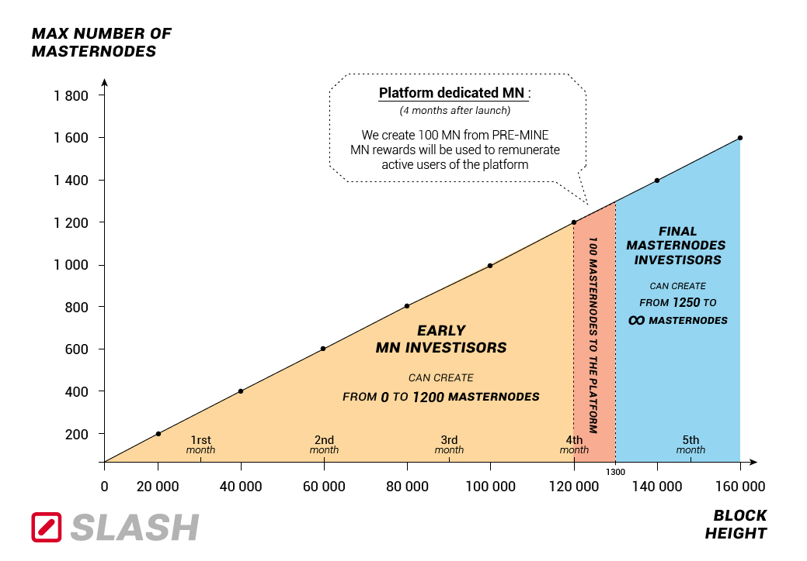

## SLASH

Slash : The Decentralised Public Blockchain for Crypto Developpers for free project community.

In recent years, more and more free projects are emerging.
Our goal is to create a platform dedicated to these projects.

This platform will serve as a goldmine of information about cryptocurency open-source projects, sharing knowledges, ideas, tutorials & tips.

__________________________________________________________________________

##### Coin : Slash
##### Ticker : SLASH
##### Block reward : 10 SLASH
##### Proof-of-Work Algorithm: x11
##### Block Time: 90 seconds

##### Maximum Coin Supply: 21 Million
##### PoS start at block : 1 000
##### Pre-Mine: 3%
##### Coin Maturity: 100 blocks

##### Masternodes: Enabled
##### Masternodes Collateral: 1 000 SLASH
##### PoS rate : 80 / 20 % (Masternode / PoW)
##### P2P masternode port :
##### RPC port :

##### Instant transactions: InstantSend (made possible by the masternode network)
##### Superior Transaction Anonymity: Using PrivateSend
##### Difficulty Retargeting: Dark Garvity Wave
##### Instant Mining Protection [1 SLASH reward to Block 500]

__________________________________________________________________________

## Introducing SLASH

 SLASH is a new decentralised open source currency, that is focusing on the creation of a community dedicated to open source softwares & projects.

The name refers to the commun symbol " / " used by all developpers in their codding. It has never been used in any cryptocurrency until now.  The currency unit of account is **SLASH**, along with its exchange ticker.

##### Open Source
SLASH is open source. Anyone is free to contribute to SLASH' development and make a pull request through Github. Further details, making community contributions as smooth as possible, will become available in the future on the new website.

##### Decentralized Ownership
Ownership and access rights are decentralized. This ensures that the long-term application and longevity is not dependent on a single individual any longer. This safeguards not only SLASH' future, but also your investment and partnerships.

##### Community Orientated
One of SLASH core value is being community oriented :

The goal is to create a community platform where people can share knowledges, ideas, tutorials & tips about open source projects. A "Like" system as also been instored on the platform in order to reward active members. Look out for "Platform founding" section for more details (start from block 120 000).

Be sure SLASH foundation team will always strive to collect feedbacks and suggestions from the community.

##### Speed & Privacy

Speed and privacy are core concerns for users today. To ensure that SLASH is as effective, SLASH will maintain a high focus on increasing anonymity and most important on increasing speed of transactions - to always be at the forefront.

### Links

- **[SLASH Website](http://slashcore.org)**
- **[SLASH Explorer](http://explorer.slashcore.org)**
- **[SLASH Pool](http://pool.slashcore.org)**
- **[SLASH Discord](https://discord.gg/axGGNfQ)**
- **[SLASH Twitter](https://twitter.com/slashcoreproject)**
- **[SLASH Bitcointalk](https://bitcointalk.org/index.php?topic=3309075.0)**

### SLASH Team

- **Stev - Lead Developer & Business Development**
- **Diz - Lead Developer & Business Development**
- **Ed - Developer**
- **Zac - Developer**
- **Josh - Developer**
- **Mike - Marketing & PR**

**Email** : support@slashcore.org / **Email** : dev@slashcore.org

__________________________________________________________________________

### Specifications

#### Notes, Knowledge Base & Support

Note: Pending full implementation and roll out of a SLASH Lightning Network, **all other SLASH' features are enabled and functional from day 0**; end-users can utilise SLASH' speed, larger chain capacity, segregated witness and Masternode functionality straight away.

Guides and additional information can be found on the [SLASH' Knowledge Base](https://slashcore.org), and direct support can be sought on the [SLASH Discord](https://discord.gg/XXXXX)

#### Instant Mining Protection [1 SLASH reward to Block 500]

SLASH blockchain has been set up to issue a 1 block subsidy up to **block height 500**.  At 960 blocks per day, this is approximately 12 hours. Also Masternodes rewards start on block 1000, witch means about 1 day from the start of the chain.

During this time, community members will be informed of launch and will be able to configure their setups for mining.

#### Maximum Coin Supply and Block Reward

SLASH will be capped at a maxium supply of **21 million coins**.  This target supports a managed inflation rate that allows for a constant block reward of **10 SLASH**.

The constant block reward prevents event cliffs related to expected "halvings" and will support a more consistent and stable participation rate over a long time horizon.

More information will be available on the SLASH' [website](https://slashcore.org)

#### x11 hashing algorithm

x11 is a widely used hashing algorithm, which takes a different approach, known as algorithm chaining. x11 consists of all 11 SHA3 contestants[13], each hash is calculated then submitted to the next algorithm in the chain. By utilizing multiple algorithms, the likelihood that an ASIC is created for the currency is minimal until a later part of it’s life cycle.

In the life cycle of Bitcoin, mining began with hobbyists which used Central Processing Units (CPUs) to mine the currency, then shortly after Graphics Processing Units (GPUs) software was created, which quickly replaced the CPUs. Years after the GPUs cycle, ASICs or Application Specific Integrated Circuits were created, which quickly replaced the GPUs.

Due to the complexity and die size required to create an ASIC for mining x11, we expect that it will take considerably longer than it did in Bitcoin, allowing for hobbyists to take part in the mining for a longer period of time. We believe this is highly important for good distribution and growth of a cryptocurrency.

Another benefit of the chaining hashing approach is high end CPUs give an average return similar to that of GPUs. Also GPUs have been reported to run 30-50% cooler, with less wattage than the Scrypt algorithm used by most current crypto-currencies.

#### InstantSend (transaction locking and masternode consensus)

This technology will allow for cryptocurrencies such as Slash to compete with nearly instantaneous transaction systems such as credit cards for point-of-sale situations while not relying on a centralized authority. Widespread vendor acceptance of Slash and InstantSend could revolutionize cryptocurrency by shortening the delay in confirmation of transactions from as long as an hour (with Bitcoin) to as little as a few seconds.

#### Dark Garvity Wave

DGW or Dark Gravity Wave is an open source difficulty-adjusting algorithm for Bitcoin-based cryptocurrencies that was first used in Darkcoin/Dash and has been adopted by other digital currencies.

DGW was authored by Evan Duffield, the developer and creator of X11/Darkcoin/Dash, as a response to a time-warp exploit found in Kimoto's Gravity Well.

In concept, DGW is similar to Kimoto Gravity Well, adjusting the difficulty levels every block (instead of every 2016 blocks like Bitcoin) by using statistical data of the last blocks found. In this way block issuing times can remain consistent, despite high fluctuations in hashpower. However it doesn't suffer from the time-warp exploit.

#### Masternodes

Masternodes will be supported with a collateral requirement of **1000 SLASH**.  
The collateral requirement has a fixed value.

Masternode payments start after approximately 1 day after the launch. More specifically, after **block height 1000**. It delays the reward mechanism to provide sufficient time for investors to set up nodes.

Once the exact collateral requirement is accumulated inside an applicable wallet, the
associated configured Masternode can be activated.

#### InstantTX and DarkSend Removal
*(Reproduced here for information purposes only, not release related)*

Dropped support for both InstantTX and DarkSend. With the SegWit upgrade these features are going to be superseeded by far superior technology. SegWit will enable the SLASH to adopt the [Lightning Network](https://lightning.network/lightning-network-paper.pdf), cross-chain atomic swaps, advanced versions of [TumbleBit](https://eprint.iacr.org/2016/575.pdf) and more.

__________________________________________________________________________

### Platform founding

To reward the participants on the platform we come with a fair system that starts on block 120 000 (time for the platform to be ready and the coin to be stabilized on different markets).

3% of the PRE-MINE will be dedicated to create 100 additional Masternodes. The rewards of these Masternodes will be used on a common wallet to be redistributed between the involved users.

Assuming that all SLASH coins are involved in masternodes by then, this allows to get about 8% of the MN rewards allocated to the platform. It represents an average of 800 coins per day of reward split between active users.

__________________________________________________________________________

### License

SLASH Core is released under the terms of the MIT license. See [COPYING](COPYING) for more
information or see https://opensource.org/licenses/MIT.

__________________________________________________________________________

### Development Process

The `master` branch is meant to be stable. Development is normally done in separate branches.
[Tags](https://github.com/slashcoreproject/slash/) are created to indicate new official,
stable release versions of SLASH' Core.

__________________________________________________________________________

### Building process

**compiling SLASH from git**

Use the autogen script to prepare the build environment.

    ./autogen.sh
    ./configure
    make

**precompiled binaries**

Precompiled binaries are available at GitHub, see
https://github.com/slashcoreproject/slash/releases

Always verify the signatures and checksums.

__________________________________________________________________________
